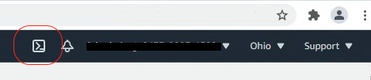
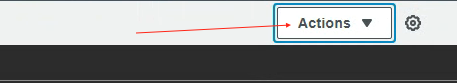

<!--
Copyright 2021 Google LLC

Licensed under the Apache License, Version 2.0 (the "License");
you may not use this file except in compliance with the License.
You may obtain a copy of the License at

     https://www.apache.org/licenses/LICENSE-2.0

Unless required by applicable law or agreed to in writing, software
distributed under the License is distributed on an "AS IS" BASIS,
WITHOUT WARRANTIES OR CONDITIONS OF ANY KIND, either express or implied.
See the License for the specific language governing permissions and
limitations under the License.
-->

# Solution Overview
This script collects information from provided AWS account and generates csv files for import into StratoZone portal for analysis.
Generated files will be placed in ./output directory. For ease of use a compress zip file will be created that can be imported directly to StratoZone using the import procedure. 
Script will collect data only on the instances user executing the script has access to. 

**NOTE** - Due to the unavailability of instance memory utilization, that metric will be ignored by the StratoZone recommendation engine.

- [Solution Overview](#solution-overview)
- [StratoZone AWS export usage](#stratozone-aws-export-usage)
- [Prerequisites](#prerequisites)
- [AWS Permissions](#AWS-Permissions)
- [Support](#Support)

# Stratozone AWS export usage

- Step 1: Login to AWS Console

- Step 2: Launch Cloud Shell \


- Step 3: Clone project to local shell
```
git clone https://github.com/GoogleCloudPlatform/aws-to-stratozone-export.git
```

- Step 4: Access cloned project directory
```
cd aws-to-stratozone-export/
```

- Step 5: Run script to start collection
```
python3 stratozone-aws-export.py
```

- Step 6: Verify output file has been generated
```
 ls ./aws-import-files.zip
```

- Step 7: When the script completes, select download file from the Actions dropdown in upper right corner. \


- Step 8: Enter the path to the output file.
```
~/aws-to-stratozone-export/aws-import-files.zip
```

- Step 9: Click Download. File is ready for import into StratoZone portal.

# Prerequisites
  AWS Cloud Shell is the recommended environment to execute the collection script as it has all required components (Python3,  ) arelay installed.

  If the script will be executed from a workstation following components will need to be installed
  - Python 3.6 or later
  - AWS SDK for Python (https://boto3.amazonaws.com/v1/documentation/api/latest/guide/quickstart.html)

# AWS Permissions
The script needs read-only access to the AWS organization where collection will be performed.

# Support
If the execution of the scipt fails please contact support-stratozone@google.com and attach log file located in ./output directory.